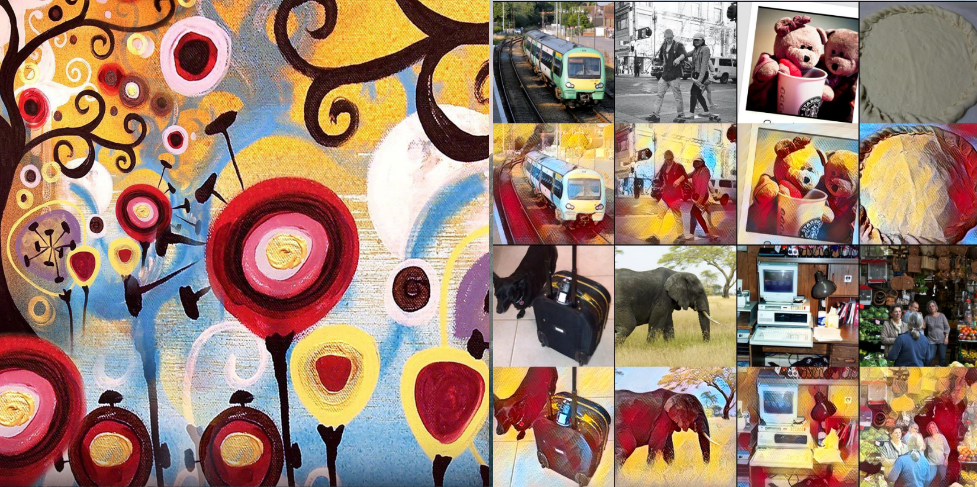

# Fast Neural Style Transfer

## 背景

以目前深度学习的技术，如果给定一张图片，完全可以让计算机识别出图片的具体内容。但是，图像的风格是一种很抽象的东西，人们可以用肉眼来分辨不同流派的画风，而计算机的眼里，每一张图片都是由许许多多的像素组成，如何利用深度学习网络来提取更复杂、更内在的特性是一个很有意思的点。

（1）在论文 [《A Neural Algorithm of Artistic Style》](https://arxiv.org/abs/1508.06576) 里就提出了对应的解决方案。但是这种方案，把生成图片的过程当做一个“训练”的过程。每生成一张图片，都相当于要训练一次模型，这中间可能会迭代几百几千次，效率很低。

（2）后来，论文 [《Perceptual Losses for Real-Time Style Transfer and Super-Resolution》](https://arxiv.org/abs/1603.08155) 提出了一套新方案，将网络分为 “训练” 和 “执行” 两个过程，一旦针对某种风格完成训练后，用新的图片生成具体该风格的图片就只需要 1s 就能完成。

本项目就是基于论文 2 所实现的快速风格转换系统。

## 效果展示

左边是 style 图片，右边是风格转换后的图片：

<p align="center">
    
</p>

## 操作方法

### 风格模型训练：

```
python3 train.py  --dataset_path <path-to-dataset> \
                  --style_image <path-to-style-image> \
                  --epochs 1 \
                  --batch_size 4 \
                  --image_size 256
```
训练集一般选择 coco 数据集；

其他的参数信息如下所示：

|参数|类型|默认值|说明|
|---|---|---|---|
|--dataset_path|str|required=True|训练集路径，设置到具体图片的上两级目录|
|--style_image|str|"style-images/mosaic.jpg"|风格图片路径|
|--epochs|int|1|Number of training epochs|
|--batch_size|int|4|Batch size for training|
|--image_size|int|256|Size of training images|
|--style_size|int|256|Size of style image|
|--lambda_content|float|1e5|Weight for content loss|
|--lambda_style|float|1e10|Weight for style loss|
|--lr|float|1e-3|Learning rate|
|--checkpoint_model|str|"/checkpoints"|Optional path to checkpoint model|
|--checkpoint_interval|int|2000|Batches between saving model|
|--sample_interval|int|1000|Batches between saving image samples|

注意，不同风格图片训练所需的参数不同，这里不需要对模型过度训练，请根据你电脑的硬件配置和具体要求合理设置。我这里采用了 32000 的数据集，epoch 设置为 10，batch_size 设置为 16（仅供参考）。

在 /checkpoints/select_model 里也提供了一些已经训练好的 model。

### 图像风格转换：

```
python3 test_on_image.py  --image_path <path-to-image> \
                          --checkpoint_model <path-to-checkpoint> \
```

### 视频风格转换：

```
python3 test_on_video.py  --video_path <path-to-video> \
                          --checkpoint_model <path-to-checkpoint> \
```

## 相关项目

官方的 『 [Fast Neural Style Transfer](https://cs.stanford.edu/people/jcjohns/eccv16/) 』 是基于 lua 实现的，项目地址：https://github.com/jcjohnson/fast-neural-style.

另外在对论文复现时，发现网上也有许许多多的 python 版本。在 GitHub 上参见了许多人的代码：

|项目|特点|
|---|---|
|[junrushao1994/fast-neural-style.tf](https://github.com/junrushao1994/fast-neural-style.tf)|基于 tensorflow，项目比较老了，只提供了几个训练好的模型，没有提供训练的代码，也没有提供具体的网络结构。|
|[OlavHN/fast-neural-style](https://github.com/OlavHN/fast-neural-style)|基于 tensorflow，做了完整的实现，可以进行模型的训练，但是训练出来的效果不是很好，在作者自己的博客中，给出了一个范例，可以看到生成的图片有很多噪声点：|
|[hzy46/fast-neural-style-tensorflow](https://github.com/hzy46/fast-neural-style-tensorflow)|进一步做了很多修改和调整。但是依旧是基于 tensorflow1.0，项目老了，对 TensorFlow2.0 的用户不太友好。|
|[eriklindernoren/Fast-Neural-Style-Transfer](https://github.com/eriklindernoren/Fast-Neural-Style-Transfer)|基于 pytorch 实现，同时可以支持图像和视频的风格迁移。|

这里不得不说一下，为了学习 TensorFlow，原本打算用 TensorFlow2.5.0 复现，但是它版本间的不兼容、api 混用的问题，还是让我打了退堂鼓。毕竟本项目的主要目的是学习，而这个学习成本属实太高了。最终还是选择了继续使用 Pytorch，整个项目也是基本上参考了 eriklindernoren/Fast-Neural-Style-Transfer，修改了一些细节问题，提供了更多的 style model 和详细的文档。

## TODO

风格转换系统还是很有意思，很值得学习的一个项目。打算添加 web 界面，或者微信小程序来用于效果展示。

『 [展示地址](http://www.thebetterkong.cn:7001/) 』

## Acknowledgement

有关「快速风格转换系统」的网络结构和相关细节，可见本项目的 /doc 文档。
