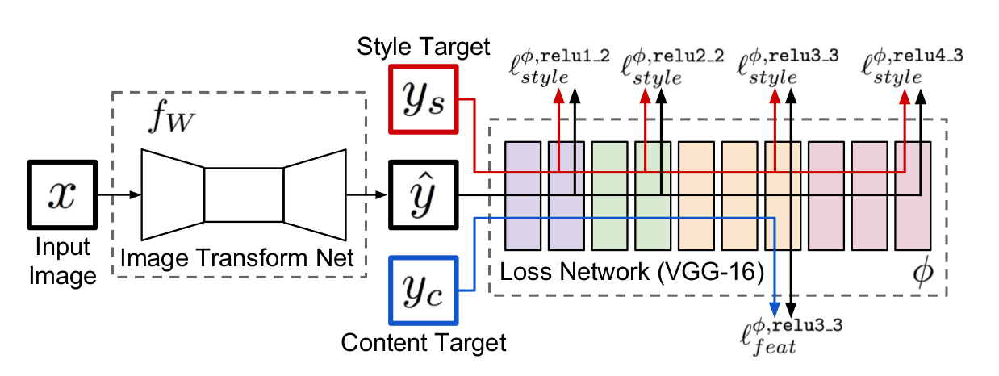

  

神经风格转换（样式迁”）是一种使用**卷积神经网络**自动将某一图像的样式（风格）应用到另一张图片上的技术，可以看做将某张图片自动施加滤镜的修饰技术。比如，我们可以把一张图片变为素描风格，油画风格，蜡笔风格等任何你想要的艺术风格。

<!-- more --> 

# 前言

接触 AI 也挺长时间了，一直都在研究各种机器学习算法的底层原理，也没怎么去具体实现过相关的项目。无意在一篇推送中看到了 “神经风格转换” 的介绍，发现这个从 16 年就兴起的技术，一直到现在热度都不减，就把相关的文章看了看，动手实现了一下。

以目前深度学习的技术，如果给定一张图片，完全可以让计算机识别出图片的具体内容。但是，图像的风格是一种很抽象的东西，人们可以用肉眼来分辨不同流派的画风，而计算机的眼里，每一张图片都是由许许多多的像素组成，如何利用深度学习网络来提取更复杂、更内在的特性是一个很有意思的点。

（1）（2015）在论文 [《A Neural Algorithm of Artistic Style》](https://arxiv.org/abs/1508.06576) 里就提出了对应的解决方案。但是这种方案，把生成图片的过程当做一个“训练”的过程。每生成一张图片，都相当于要训练一次模型，这中间可能会迭代几百几千次，效率很低。

（2）（2016）后来，论文 [《Perceptual Losses for Real-Time Style Transfer and Super-Resolution》](https://arxiv.org/abs/1603.08155) 提出了一套新方案，将网络分为 “训练” 和 “执行” 两个过程，一旦针对某种风格完成训练后，用新的图片生成具体该风格的图片就只需要 1s 就能完成。

（3）（2017）任意风格转换：这个模型能够自行指定内容和风格图片，还能快速生成图像。[《Arbitrary Style Transfer in Real-time with Adaptive Instance Normalization》](https://openaccess.thecvf.com/content_ICCV_2017/papers/Huang_Arbitrary_Style_Transfer_ICCV_2017_paper.pdf)，受 Batch Normalization 启发。

（4）（2017）[《Deep Photo Style Transfer》](https://arxiv.org/abs/1703.07511), 这个是 Adobe 公司的论文，旨在解决 Gatys(1) 风格迁移导致的照片失真问题。算法改进体现在损失函数上，模型结构并没有改变。其生成的图片很真实，没有扭曲，基本上是颜色上的仿射变换。

（5）（2019）[《Learning Linear Transformations for Fast Arbitrary Style Transfer》](https://arxiv.org/pdf/1808.04537.pdf)，它是 CVPR2019 的新论文是对（3）的扩展，它指出任意风格迁移的方法是通过在内容图像特征和一个转换矩阵之间的乘法，使得参考图像（风格图像）的二阶统计量转移到内容图片上，而转移矩阵是通过一个预先确定好的算法从特征中计算得到的。这些算法要么需要很大的计算量，要么就是建立特征的方差但会使得合成的图像有人工痕迹（artifacts）。该文章在理论上推导了转换矩阵的形式，并且通过一个前向网络学习到了转换矩阵从而可以进行任意风格迁移。

（6）......

后期的方案，其实都是在（1）和（2）上的扩展，所以本文主要介绍论文（1）（2）里的实现方案。

# 论文（1）---原始方案

作为图像风格转换的鼻祖，论文（1）里提出了一种完全不需要新网络架构的风格迁移算法。它的网络构架是在 **VGG19** 基础上稍加改造而成的，而且网络参数也使用预训练（ImageNet）网络的参数。

它的核心原理，就是利用**卷积神经网络（CNN）具有很强的图像特征（feature/representation）提取能力**。

> 对于深度网络来讲，深度卷积分类网络具有良好的特征提取能力，不同层提取的特征具有不同的含义，每一个训练好的网络都可以视为是一个良好的特征提取器。另外，深度网络由一层层的非线性函数组成，可以视为是复杂的多元非线性函数，此函数完成输入图像到输出的映射，因此，完全可以使用训练好的深度网络作为一个损失函数计算器。

它的输入应该是三个：**内容图片**（content）、**风格图片**（style）、**随机图片**。

如下图所示，我们可以看到：

- 对于风格图片，通过包含多层的特征相关性（可用 **Gram 矩阵**表示），可获得多尺度图像风格的重构，捕获其纹理信息。这样构建的网络可以忽略图像的具体细节，保留风格。

- 对于内容图片，网络的深层（d 和 e）提取的是高维特征，同时也丢弃了细节信息；浅层网络（a, b 和 c）提取的是低维特征，图片的细节大多都保留下来了。

> 两张图像经过预训练好的分类网络，若提取出的低维特征在数值上基本相等，则这两张图像越相似。换句话说，两张图像相似等价于二者特征的 Gram 矩阵具有较小的弗罗贝尼乌斯范数。
> 两张图像经过预训练好的分类网络，若提取出的高维特征之间的欧氏距离越小，则这两张图像内容越相似

> $Gram$ 矩阵的数学形式如下：$G_j(x) = A \ast A^T$，在文末有详细介绍。
> 
> 它实际上是矩阵的内积运算，在风格迁移算法中，其计算的是 feature map 之间的偏心协方差，在 feature map 包含着图像的特征，每个数字表示特征的强度，Gram 矩阵代表着特征之间的相关性，因此，Gram 矩阵可以用来表示图像的风格，因此可以通过 Gram 矩阵衡量风格的差异性。

这样，为了将内容图片和风格图片的相关信息融合，我们<mark>先初始化一张白噪声图片，然后通过不断训练使这张随机图片的特征同时与内容图片和风格图片之间的距离最小化，也就成了我们所需的风格化结果图</mark>。这个过程如下所示：

损失函数定义为：

$$
L_{total}(\vec{p},\vec{a},\vec{x}) = \alpha L_{content}(\vec{p}, \vec{x}) + \beta L_{style}(\vec{a}, \vec{x})
$$

- 注意：整个训练过程优化的参数不再是网络权重 $\omega$ 和 $b$，而是初始化的随机图片。

整个过程，用如下动图展示：

就像我们一开始说的那样，该方案虽然能获得不错的风格迁移效果，但是每张图片的生成都得经过完整的训练，所以生成速度很慢，扩展性比较差。

# 论文（2）---快速风格迁移

论文（2）里，Johnson 等人在 Gatys 等人的工作上对迁移方案进行了改进。它们将风格转换的训练和生成过程分离，针对每一种风格训练一种网络，一旦网络模型训练好之后，就可将它应用于你想要的任何内容图片。

网络的主要结构如下所示：

由图可见，整个网络主要包含两部分：<mark>图像转换网络 $f_w$（Image Transfrom Net）</mark>和<mark>预训练好的损失计算网络 VGG-16（Loss Network）</mark>。主要包含两个过程：



训练过程：选择一张风格图片。将训练集（常用 coco 数据集）输入网络，Transform Net（生成网络）生成结果图片 $\hat{y}$。Loss Net（损失网络）提取图片特征，将结果图片 $\hat{y}$ 与目标风格图片 $y_s$ 和目标内容图片（输入）$y_c$ 做损失计算。然后根据这个**损失值来调整 Transform Net 的网络权值**。通过最小化损失值来达到目标效果。
  
生成过程：给定任意一张图片，将其输入已经训练好的 Transform Net，就能输出这张图片风格转换后的结果。整个生成网络只需要执行一次，所以风格迁移图片生成的速度很快。



---

生成网络 $f_w$（Image Transfrom Net） 以内容图片 $x$ 作为输入，输出生成后的图片 $\hat{y}$。其网络定义如下所示：

- 生成网络的本质是一个**深度残差网络**，不用任何的池化层，取而代之的是用步幅卷积或微步幅卷积做网络内的上采样或者下采样。
- Input 和 Output 都是 3×256×256 的三通道彩色图像
- 网络结构三个卷积层（两个进行下采样）后紧接着 5 个残差块。然后两个**上采样**（邻近插值的方式），最后一个卷积层。
- 除了最末的输出层以外，所有的非残差卷积层都跟着一个 **instance-normalization** 和 ReLU。
- 第一层和最后一层的卷积核是 9x9，其余均为 3x3。每个残差块中包含两层卷积。
- 最末层使用一个 Tanh(sigmoid) 进行缩放，确保输出图像的像素在 [0,255] 之间。

这里面有几个需要注意的 Trick：

1. 使用深度残差网络是因为，残差连接更容易让网络更容易学习识别功能； 这是图像转换网络的一个吸引人的特性，因为在大多数情况下，输出图像应该与输入图像共享结构
2. 论文[《Instance Normalization: The Missing Ingredient for Fast Stylization》](https://link.zhihu.com/?target=https%3A//arxiv.org/abs/1607.08022)里提到的，用 Instance Normalization 来代替 Batch Normalization，可以改善风格迁移的质量。
3. 通常，我们在使用网络生成图像的时候，都是采用转置卷积直接对图像进行上采样。但是，文章[《Deconvolution and Checkerboard Artifacts》](https://distill.pub/2016/deconv-checkerboard/) 指出了转置卷积的一些问题，它认为转置卷积由于不合理的重合，使得生成的图片总是有“棋盘状的噪声点”，它提出使用 “先将图片放大，再做卷积” 的方式来代替转置卷积做上采样，可以提高生成图片的质量。
4. 为了鼓励输出图像 $\hat{y}$ 的空间平滑性，允许 feature inversion 和 super resolution 并使用了 total variation regularizer $l_{TV}(\hat{y})$。
   
---

损失网络 $\phi$（Loss Network，VGG16）是一个在 ImageNet 上预先训练好用于图像分类的 CNN，这个 CNN 已经学会感知和语义信息编码。这样它以生成结果 $\hat{y}$、风格图片 $y_s$、内容图片 $y_c$（即 $x$）作为输入，用来计算他们之间的损失。感知损失函数分为两个：

- 内容损失（$\hat{y}, y_c$）：是输出图像和内容图像，它们之间的 L2 距离

$$
l_{feat}^{\phi,j}(\hat{y},y_c) = \frac{1}{C_jH_jW_j}{||\phi_j(\hat{y})-\phi_j(y_c)||}^2_2
$$

- 风格损失（$\hat{y}, y_s$）：是输出图像和风格图像，它们 Gram 矩阵之间的平方 Frobenius 范数

$$
l_{style}^{\phi,j}(\hat{y},y_s) = {||G_j^\phi(\hat{y})-G_j^\phi(y_s)||}^2_F
$$

- 那么，总的损失就是这些损失值的加权和：

$$
Loss_{total} = \lambda_1l_{feat}^{\phi, relu3\_3} + \lambda_2l_{style}^{\phi, relu1\_2} + \lambda_3l_{style}^{\phi, relu2\_2} + \lambda_4l_{style}^{\phi, relu3\_3} + \lambda_5l_{style}^{\phi, relu4\_3}
$$

> 其中：
> 
> - $\phi_j(x)$ 是处理图像 $x$ 时，网络 $\phi$ 第 $j$ 层的激活值，$\phi_j(x)$ 将是形状为 $C_jH_jW_j$ 的 feature map；
> - $G_j^\phi(x)$ 是网络 $\phi$ 第 $j$ 层的 Gram 矩阵：它是一个 $C_j \ast C_j$ 的矩阵，其元素来源：
> > 
> $$
> G_j^\phi(x)_{c,c'} = \frac{1}{C_jH_jW_j}\sum^{H_j}_{h=1}\sum^{W_j}_{w=1}\phi_j(x)_{h,w,c}\phi_j(x)_{h,w,c'}
> $$
> 
> - 可以将 $\phi_j(x)$ 理解为一个 $C_j$ 维度的 feature（表示为矩阵 $\psi）$，那么每个 feature 的尺寸就是 $H_j \ast W_j$。那么 Gram 矩阵就是 $C_j$ 个 feature 之间的偏心协方差，那么 Gram 矩阵的求法就可以重新表示为：
> 
> $$
> G_j^\phi(x) = \frac{\psi\psi^T}{C_jH_jW_j}
> $$

---

注意，结合方案 1 来理解方案 2，弄清楚它们之间的差别和联系。本论文的复现，可见 [[地址](https://github.com/TheBetterKong/fast-neural-style-transfer)]。

# 补充：Gram 矩阵

1、定义：

定义 $n$ 维欧式空间中任意 $k(k \leq n)$ 个向量 $\alpha_1, \alpha_2, ..., \alpha_k$ 的内积所组成的矩阵：

$$
\Delta(\alpha_1, \alpha_2, ...,\alpha_k) = 
\begin{bmatrix}
(\alpha_1,\alpha_1) & (\alpha_1,\alpha_2) & ... & (\alpha_1,\alpha_k) \\\\
(\alpha_2,\alpha_1) & (\alpha_2,\alpha_2) & ... & (\alpha_2,\alpha_k) \\\\
... & ... & ... & ... \\\\
(\alpha_k,\alpha_1) & (\alpha_k,\alpha_2) & ... & (\alpha_k,\alpha_k) 
\end{bmatrix}
$$

陈伟 $k$ 个向量 $\alpha_1, \alpha_2, ..., \alpha_k$ 的格拉姆矩阵（Gram 矩阵）。

一个简单的例子：

向量 $\vec{x_1} = (3,3), \vec{x_2} = (4,3), \vec{x_3} = (1,1)$，的 Gram 矩阵为：

$$
Gram(\vec{x_1}, \vec{x_2}, \vec{x_3}) = 
\begin{bmatrix}
\vec{x_1} \ast \vec{x_1}^T & \vec{x_1} \ast \vec{x_2}^T & \vec{x_1} \ast \vec{x_3}^T \\\\
\vec{x_2} \ast \vec{x_1}^T & \vec{x_2} \ast \vec{x_2}^T & \vec{x_2} \ast \vec{x_3}^T \\\\
\vec{x_3} \ast \vec{x_1}^T & \vec{x_3} \ast \vec{x_2}^T & \vec{x_3} \ast \vec{x_3}^T 
\end{bmatrix} = \begin{bmatrix}
18 & 21 & 6 \\\\
21 & 25 & 7 \\\\
6 & 7 & 2
\end{bmatrix}
$$

2、意义：

格拉姆矩阵可以看做 feature 之间的偏心协方差矩阵（即没有减去均值的协方差矩阵），在 feature map 中，每个数字都来自于一个特定滤波器在特定位置的卷积，因此每个数字代表一个特征的强度，而 Gram 计算的实际上是两两特征之间的相关性，哪两个特征是同时出现的，哪两个是此消彼长的等等，同时，Gram 的对角线元素，还体现了每个特征在图像中出现的量，因此，Gram有助于把握整个图像的大体风格。有了表示风格的 Gram Matrix，要度量两个图像风格的差异，只需比较他们 Gram Matrix 的差异即可。

总之， 格拉姆矩阵用于度量各个维度自己的特性以及各个维度之间的关系。内积之后得到的多尺度矩阵中，对角线元素提供了不同特征图各自的信息，其余元素提供了不同特征图之间的相关信息。这样一个矩阵，既能体现出有哪些特征，又能体现出不同特征间的紧密程度。

# 参考

- [用 Python 快速实现图片的风格迁移](http://itpcb.com/a/284501)
- [风格迁移背后原理及 tensorflow 实现](https://blog.csdn.net/qq_25737169/article/details/79192211?utm_term=%E9%A3%8E%E6%A0%BC%E8%BF%81%E7%A7%BB%E6%98%A0%E5%B0%84&utm_medium=distribute.pc_aggpage_search_result.none-task-blog-2~all~sobaiduweb~default-1-79192211&spm=3001.4430)
- [Gram 矩阵](https://blog.csdn.net/wangyang20170901/article/details/79037867)
- 相关论文，在文章的对应都已直接给出